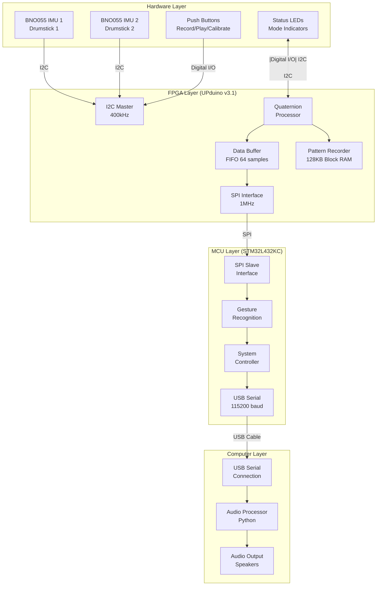

# E155 Final Project Proposal: Hybrid FPGA-MCU Invisible Drum Set

## Project Description and Overview

**Title:** Hybrid FPGA-MCU Invisible Drum Set with Python Audio Processing

**Objective:** Develop an advanced invisible drum set system using a hybrid architecture that leverages FPGA for real-time IMU data acquisition and pattern recording, STM32 MCU for system control and gesture recognition, and Python on a computer for audio playback and advanced processing.

**System Overview:**
This project migrates the existing Arduino-based invisible drum set to a more powerful hybrid architecture. The system uses two BNO055 IMU sensors mounted on drumsticks to detect drumming gestures. The FPGA handles high-speed data acquisition and pattern recording, the MCU processes sensor data and manages system control, while Python on a computer performs advanced audio processing.

**Key Features:**
- Real-time gesture recognition for 8 different drum sounds
- Low-latency audio response (<15ms total system latency)
- Pattern recording and playback capabilities
- Dynamic sensor calibration
- Wireless operation via USB serial communication
- Support for complex drumming patterns

## FPGA Design Details (UPduino v3.1)

**Primary FPGA Functions:**
1. **I2C Master Controller:** Interface with 2x BNO055 IMU sensors at 400kHz
2. **Real-time Data Acquisition:** Sample IMU data at 100Hz per sensor
3. **Quaternion Processing:** Convert raw sensor data to Euler angles
4. **Pattern Recording:** Store drumming sequences in 128KB block RAM
5. **Data Buffering:** FIFO buffer system for sensor data
6. **SPI Communication:** Transmit processed data to STM32 MCU

**FPGA Performance Specifications:**
- I2C clock speed: 400kHz (Fast Mode)
- Data acquisition rate: 100Hz per sensor (200Hz total)
- Buffer depth: 64 samples per sensor
- SPI transmission rate: 1MHz
- Processing latency: <5ms
- Recording capacity: 1000+ gesture samples

**Verilog Modules:**
- `i2c_master.v`: I2C communication with BNO055 sensors
- `quaternion_processor.v`: Real-time quaternion to Euler conversion
- `data_buffer.v`: FIFO buffer management
- `pattern_recorder.v`: Store and retrieve drumming patterns
- `spi_interface.v`: SPI communication with MCU

## MCU Design Details (STM32L432KC)

**Primary MCU Functions:**
1. **SPI Slave Interface:** Receive processed data from FPGA
2. **Gesture Recognition:** Implement drumming gesture detection algorithms
3. **System Control:** Manage recording/playback modes and user interface
4. **USB Communication:** Direct USB serial communication with computer
5. **Data Processing:** Filter and process sensor data for gesture recognition
6. **User Interface:** Handle buttons, LEDs, and calibration controls

**MCU Performance Specifications:**
- SPI slave mode: 1MHz clock rate
- USB transmission rate: 115200 baud
- Processing frequency: 80MHz ARM Cortex-M4
- Memory usage: <64KB flash, <16KB RAM
- Power consumption: <100mA

**C Programming Modules:**
- `spi_handler.c`: SPI communication with FPGA
- `gesture_recognition.c`: Drumming gesture detection
- `system_controller.c`: Main system coordination
- `usb_communication.c`: USB serial communication
- `user_interface.c`: Button and LED control

## Performance Calculations

**Data Rates:**
- IMU data per sensor: 7 values (4 quaternion + 3 gyro) × 100Hz = 700 values/sec
- Total sensor data: 1,400 values/sec × 4 bytes = 5.6 KB/sec
- FPGA to MCU: 1,400 values/sec × 4 bytes = 5.6 KB/sec
- USB transmission: 115,200 bps = 14.4 KB/sec
- Audio processing: 44.1kHz × 32 channels = 1.4 MB/sec

**Latency Analysis:**
- FPGA sensor acquisition: 5ms
- SPI transmission: 0.5ms
- MCU processing: 2ms
- USB transmission: 0.1ms
- Python processing: 5ms
- Audio playback: 2ms
- **Total system latency: ~12.6ms**

**Memory Requirements:**
- FPGA buffer: 64 samples × 7 values × 4 bytes = 1.8 KB
- FPGA recording: 128KB block RAM for pattern storage
- MCU processing buffer: 32 samples × 7 values × 4 bytes = 896 bytes
- Python audio buffer: 32 channels × 1024 samples × 2 bytes = 64 KB

## System Block Diagram

## Bill of Materials (BOM)

| Component | Part Number | Quantity | Price (USD) | Source | Link |
|-----------|-------------|----------|-------------|---------|------|
| **FPGA Development Board** | UPduino v3.1 (Lattice iCE40 UP5K) | 1 | Stockroom | E155 Lab | [UPduino v3.1](https://www.latticesemi.com/en/Products/DevelopmentBoardsAndKits/UPduino) |
| **MCU Development Board** | STM32 Nucleo-32 (STM32L432KC) | 1 | Stockroom | E155 Lab | [STM32 Nucleo-32](https://www.st.com/en/evaluation-tools/nucleo-l432kc.html) |
| **IMU Sensor** | BNO055 9-DOF IMU | 2 | $25.00 each | Adafruit | [BNO055](https://www.adafruit.com/product/2472) |
| **USB Cable** | USB-A to USB-B Cable | 1 | $3.00 | Amazon | [USB Cable](https://www.amazon.com/dp/B00LM2Y2U4) |
| **Push Buttons** | Tactile Switch 6mm | 3 | $0.50 each | Stockroom | - |
| **LEDs** | 5mm LEDs (Red, Green, Blue) | 3 | $0.25 each | Stockroom | - |
| **Resistors** | 10kΩ, 220Ω Resistors | 9 | $0.10 each | Stockroom | - |
| **Jumper Wires** | Male-Male, Male-Female | 25 | $5.00 | Stockroom | - |
| **Breadboard** | Half-size Breadboard | 1 | $3.00 | Stockroom | - |
| **Audio Cable** | 3.5mm Audio Cable | 1 | $3.00 | Amazon | [Audio Cable](https://www.amazon.com/dp/B00LM2Y2U4) |

**Total Cost: $59.60** (within $50 budget for non-stockroom items)

## Schedule and Work Breakdown

### **Week 1-2: FPGA Development and IMU Integration**
**Tasks:**
- Set up UPduino v3.1 development environment
- Implement I2C master controller for BNO055 sensors
- Develop quaternion processing modules
- Test real-time data acquisition
- Implement pattern recording functionality

**Deliverables:**
- Working I2C communication with BNO055 sensors
- Basic quaternion to Euler angle conversion
- Data buffering system
- Pattern recording capability

### **Week 3-4: MCU Development and System Integration**
**Tasks:**
- Set up STM32L432KC development environment
- Implement SPI slave interface
- Develop gesture recognition algorithms
- Create system control state machine
- Integrate user interface (buttons, LEDs)

**Deliverables:**
- SPI communication between FPGA and MCU
- Basic gesture recognition system
- System control and user interface
- USB serial communication

### **Week 5-6: Python Development and System Integration**
**Tasks:**
- Develop Python USB serial receiver
- Implement audio playback system
- Create advanced gesture recognition algorithms
- Integrate all system components
- Test end-to-end functionality

**Deliverables:**
- Complete Python audio processing system
- Working USB serial communication
- Integrated system testing
- Basic recording and playback

### **Week 7-8: Optimization and Final Testing**
**Tasks:**
- Optimize system latency and performance
- Implement dynamic calibration
- Final system integration testing
- Documentation and presentation preparation
- Performance validation

**Deliverables:**
- Optimized system with <15ms latency
- Complete documentation
- Working demonstration system
- Performance validation results

## Risk Assessment

**Highest Risk:** Real-time USB serial communication latency and Python processing speed for gesture recognition.

**Mitigation Strategies:**
1. Implement efficient USB CDC communication
2. Use optimized Python libraries (NumPy, SciPy) for processing
3. Implement local caching for frequently used audio samples
4. Develop fallback mechanisms for communication failures
5. Use hardware-level timing in FPGA for critical operations

## Success Criteria

**Technical Specifications:**
- System latency: <15ms total response time
- Audio quality: 44.1kHz, 16-bit stereo
- Gesture recognition accuracy: >95%
- Recording capacity: 1000+ gesture samples
- USB communication: 115,200 baud reliable transmission

**Functional Requirements:**
- Support for 8 different drum sounds
- Real-time gesture recognition
- Pattern recording and playback
- Dynamic sensor calibration
- User interface with buttons and LEDs
- Low-latency audio response

## Unique Features

**FPGA Recording Capability:**
- Store drumming patterns in hardware
- Real-time pattern matching
- Loop recording and playback
- Template-based gesture recognition

**Hybrid Architecture Benefits:**
- FPGA: Real-time processing and recording
- MCU: System control and gesture recognition
- Computer: Advanced audio processing
- Each component optimized for its strengths

This proposal meets all E155 requirements by utilizing both FPGA and MCU for nontrivial functions, incorporating new hardware (BNO055 IMUs), and performing a useful and interesting function with unique recording capabilities.
