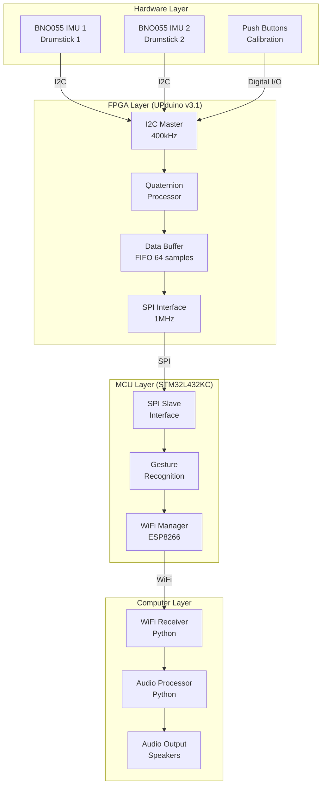

# System Block Diagram

## Data Flow:
1. **IMU Sensors** → I2C → **FPGA** → SPI → **MCU** → WiFi → **Computer** → Audio
2. **Buttons** → Digital I/O → **FPGA** → SPI → **MCU** → WiFi → **Computer** (Calibration)
